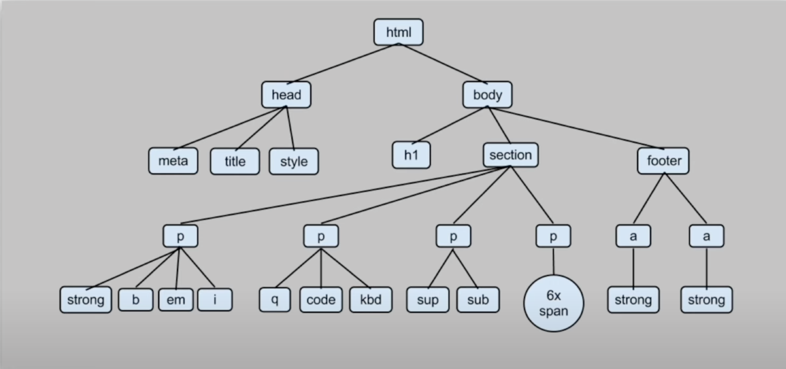

BeatifulSoup 是一个可以从 HTML 或 XML 文件中提取数据的 Python 库。它能够通过你喜欢的转换器实现惯用的文档导航，查找，修改文档的方式。

## BeatifulSoup 的解析器

```python
soup = BeautifulSoup(resp, "html.parser") # html.parser 是默认的解析器
```

BeatifulSoup 解析器有 4 种，分别是：

- html.parser：Python 内置的 HTML 解析器
- lxml：效率更高的 HTML/XML 解析器
- html5lib：HTML5 解析器

解析成树状结构


## 下载模块 bs4

```python
pip3 install bs4
```

## bs4 常用方法说明

| 方法/属性                                                   | 作用                                  |
| ----------------------------------------------------------- | ------------------------------------- |
| find_all(name, attrs, recursive, string, limit, \*\*kwargs) | 查找所有符合条件的标签，返回列表      |
| soup.title                                                  | 返回第一个符合条件的标签              |
| soup.find(name)                                             | 找到第一个匹配的标签                  |
| soup.find_all(name)                                         | 找到所有匹配的标签                    |
| soup.find(id="link2")                                       | 通过属性查找                          |
| soup.find_all(attrs={"id":"link2"})                         | 通过属性查找                          |
| tag.get('属性名')                                           | 获取标签属性，例如 href、src 等       |
| tag.text / tag.get_text()                                   | 获取标签的文本内容                    |
| soup.select('css 选择器')                                   | 使用 CSS 选择器语法提取标签（更灵活） |
