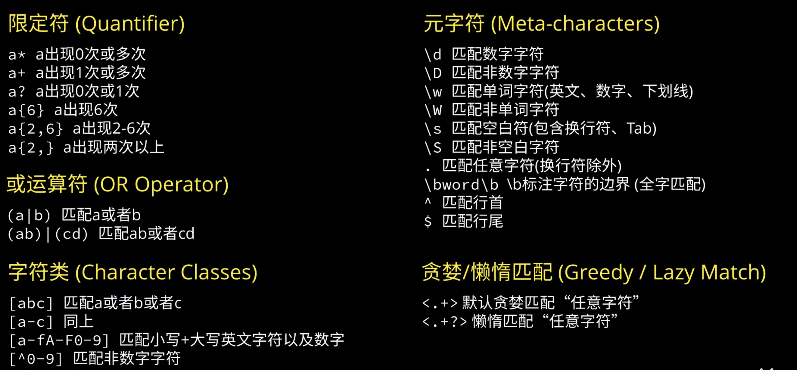

## 🔹 常用正则表达式字符和作用
| 符号 / 表达式 | 含义 | 示例 | 说明 |
|----------------|------|------|------|
| ^              | 匹配字符串开头       | ^abc         | 匹配以 abc 开头的字符串 |
| $              | 匹配字符串结尾       | abc$         | 匹配以 abc 结尾的字符串 |
| .              | 匹配任意单个字符     | a.b          | 匹配 a+b 中间是任意字符 |
| []             | 字符集合             | [abc]        | 匹配 a 或 b 或 c |
| [^]            | 否定字符集           | [^abc]       | 匹配不是 a b c 的字符 |
| -              | 范围表示             | [a-z]        | 匹配 a 到 z 的小写字母 |
| *              | 匹配前一个 0 次或多次| a*           | 匹配 "", a, aa, aaa 等 |
| +              | 匹配前一个 1 次或多次| a+           | 匹配 a, aa, aaa 等 |
| ?              | 匹配前一个 0 或 1 次 | a?           | 匹配 "" 或 a |
| {n}            | 恰好 n 次            | a{3}         | 匹配 aaa |
| {n,}           | 至少 n 次            | a{2,}        | 匹配 aa, aaa, aaaa... |
| {n,m}          | n 到 m 次            | a{2,4}       | 匹配 aa, aaa, aaaa |
| |              | 或，匹配多个之一     | abc|def      | 匹配 abc 或 def |
| ()             | 分组                 | (abc)+       | 捕获 abc、abcabc 等 |
| \              | 转义字符             | \.           | 匹配一个点号 . |
| \d             | 匹配数字             | \d+          | 匹配任意数字字符（等价于 [0-9]）|
| \D             | 匹配非数字           | \D+          | 匹配 abc、空格等 |
| \w             | 匹配单词字符         | \w+          | 匹配任意字母、数字或下划线字符（等价于 [a-zA-Z0-9_]） |
| \W             | 匹配非单词字符       | \W+          | 匹配 !@# 空格等 |
| \s             | 匹配空白字符         | \s+          | 匹配空格、换行、Tab |
| \S             | 匹配非空白字符       | \S+          | 匹配所有非空格字符 |
| (?P<name>...)  | 命名分组             | (?P<year>\d{4}) | 命名 year 可 group('year') |

## 🔹 特殊符号说明
| 符号 | 是否需要转义 | 用途 |
|------|----------------|------|
| .    | ✅ 是          | 匹配任意单个字符 |
| &    | ❌ 否          | 正则中无特殊含义，直接匹配字符 & |
| ^    | ✅ 是          | 表示开头（或在 [] 中表示非） |
| $    | ✅ 是          | 表示结尾 |
| []   | ✅ 是          | 表示字符集合 |
| ()   | ✅ 是          | 分组和捕获 |
| \    | ✅ 是          | 转义特殊字符，如 \d, \. |
| ?    | ✅ 是          | 0 或 1 次匹配，或非贪婪匹配 |
| *    | ✅ 是          | 0 次或多次匹配 |
| +    | ✅ 是          | 1 次或多次匹配 |
| {}   | ✅ 是          | 匹配次数范围 |
| |    | ✅ 是          | 或操作，匹配多个之一 |

## 🔹 常见正则表达式示例
| 场景         | 正则表达式               | 匹配内容        |
|--------------|--------------------------|-----------------|
| 匹配邮箱     | \w+@\w+\.\w+              | abc@xyz.com     |
| 匹配手机号   | 1[3-9]\d{9}               | 13812345678     |
| 匹配日期     | \d{4}-\d{2}-\d{2}         | 2025-05-14      |
| 匹配中文     | [\u4e00-\u9fa5]+          | 你好世界         |
| 匹配IP地址   | \d{1,3}(\.\d{1,3}){3}     | 192.168.1.1     |
