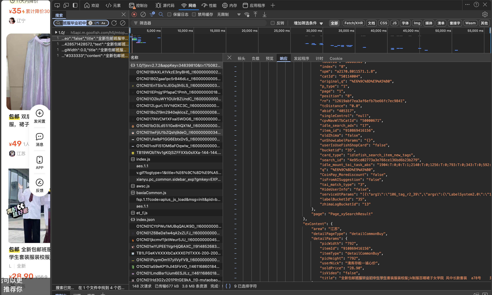
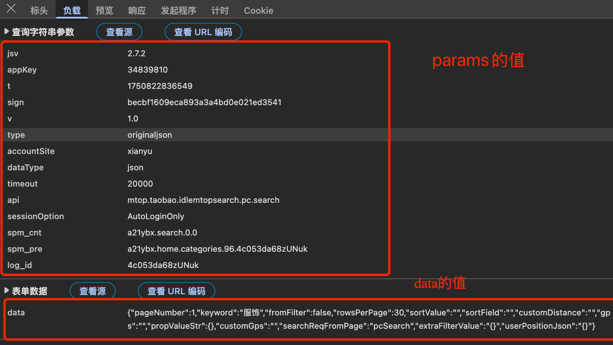
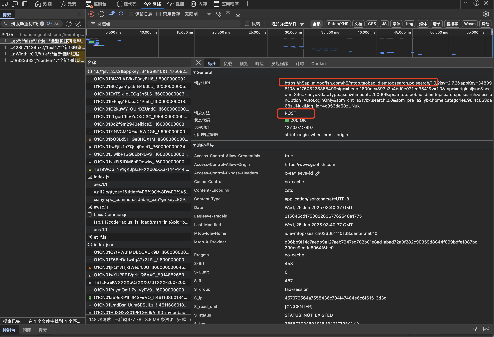
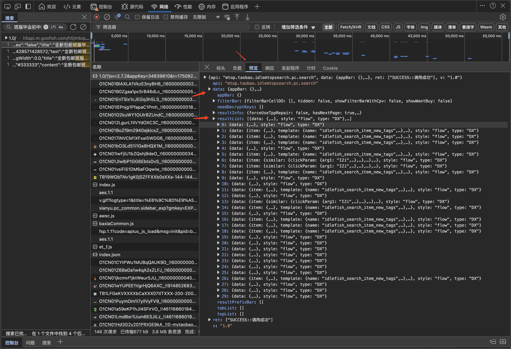

# Python 爬虫闲鱼等网页数据

### 通过 F12 进行分析

> 进入一个类型的网页，F12 进行网络抓包，通过搜索找到自己想要的数据

比如这里搜索： 班服毕业初中生学生


> 获取参数



> 其他的一些参数比如： url 和 cookie 还有 headers 都在表头里找



如果写入data数据了，就可以只写被框柱的url


### 通过json模块处理数据

我们需要的是data数据，所以需要处理一下

```python

```
### 翻页收集
